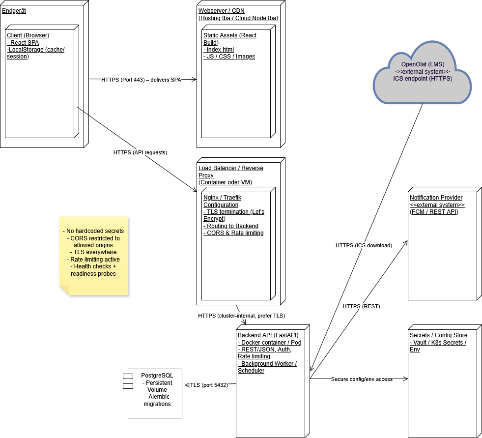

# Architekturdokumentation der Software NAME

Die Architekturdokumentation basiert auf dem Template von arc42[^1].

# Einführung und Ziele

```Benötigen wir für die Einzelarbeit nicht```

## Funktionale Anforderungen

*Hier kommt das Use Case Diagramm mit Kurzbeschreibung hin*

Kurzbeschreibung:
| Element | Beschreibung |
| --- | --- |
|||

# Randbedingungen

```Benötigen wir für die Einzelarbeit nicht```

# Kontext & Abgrenzung


Kurzbeschreibung:
| Element | Beschreibung |
| --- | --- |
|||

# Lösungsstrategie

```Benötigen wir für die Einzelarbeit nicht```

# Bausteinsicht

```Benötigen wir für die Einzelarbeit nicht```

# Laufzeitsicht

```Benötigen wir für die Einzelarbeit nicht```

# Verteilungssicht


Kurzbeschreibung:
| Element | Beschreibung |
| --- | --- |
|||

# Querschnittliche Konzepte

```Benötigen wir für die Einzelarbeit nicht```

# Architekturentscheidungen

```Benötigen wir für die Einzelarbeit nicht```

# Qualitätsanforderungen

```Benötigen wir für die Einzelarbeit nicht```

# Risiken & Technische Schulden

```Benötigen wir für die Einzelarbeit nicht```

# Glossar

Optional: 
| Begriff / Abkürzung | Beschreibung |
| --- | --- |
|||

[^1]: [arc42-Template](https://www.arc42.de/overview/)
